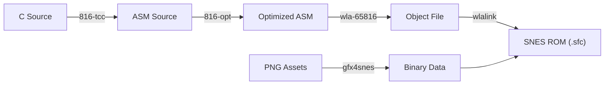

# SNES Build Tools

A production-ready C development environment for Super Nintendo Entertainment System (SNES) homebrew. This toolchain provides a cloning-to-running experience with automated dependency management, a modern build pipeline, and a feature-rich demo ROM.


---

## Documentation Index

| Doc                                        | Description                                              |
| :----------------------------------------- | :------------------------------------------------------- |
| **[Start Here](docs/README.md)**           | **Central documentation hub and navigation**             |
| [Installation](docs/install.md)            | Setup guide for Windows, Linux, and macOS                |
| [Setup & Config](docs/setup.md)            | Environment variables and configuration                  |
| [First Run](docs/first-run.md)             | Building your first ROM                                  |
| [Architecture](docs/implementation.md)     | Build pipeline and project structure                     |
| [API Reference](docs/api.md)               | SDK functions and library usage                          |
| [SNES Hardware](docs/schema.md)            | VRAM, memory mapping, and hardware constraint references |
| [Troubleshooting](docs/troubleshooting.md) | Common errors and fixes                                  |

---

## Project Overview

**SNES Build Tools** solves the complexity of setting up a retro-console development environment. Instead of manually hunting down compilers, linkers, and converters, this repository provides:

1.  **Automated Toolchain**: Scripts that download and configure PVSnesLib, 816-tcc, wla-65816, and gfx4snes.
2.  **Modern Project Template**: A `Makefile`-driven build system that handles dependency tracking and asset conversion.
3.  **Rich Demo**: A "Hello World" that actually demonstrates hardware capabilities (HDMA, Mode 1, VRAM management).

### Key Features

- **Zero-Config Install**: `install.bat` / `install.sh` handles everything.
- **Asset Pipeline**: Automatic conversion of PNGs to SNES bitplanes and palettes.
- **C & ASM Hybrid**: Write game logic in C, drop to Assembly for performance.

---

## Architecture Summary

The system follows a standard compilation pipeline modified for the 65c816 CPU:



See [Implementation Docs](docs/implementation.md) for details.

---

## Tech Stack

- **SDK**: [PVSnesLib v4.5.0](https://github.com/alekmaul/pvsneslib)
- **Compiler**: `816-tcc` (C99-like syntax)
- **Assembler**: `wla-65816`
- **Asset Tool**: `gfx4snes`
- **Build System**: GNU Make
- **Target Machine**: SNES / Super Famicom (Ricoh 5A22 @ 3.58MHz)

---

## Quick Start

### 1. Prerequisites

- **Windows**: Git Bash (recommended) or partial WS support.
- **Linux/macOS**: `curl`, `unzip`, `make`, `gcc` (for tool compilation if needed).

### 2. Install

```bash
git clone <repo-url>
cd snes-build-tools

# Windows
install.bat

# Linux / macOS
./install.sh
```

### 3. Build Demo

```bash
cd projects/hello-snes-world
make
```

### 4. Run

Open `projects/hello-snes-world/hello_snes_world.sfc` in your emulator of choice (Mesen, snes9x, bsnes).

See [First Run Guide](docs/first-run.md) for details.

---

## Testing & Verification

Testing is primarily performed via emulation.

- **Unit Tests**: Not currently applicable for the extensive hardware interaction.
- **Integration Tests**: Build verification via `make clean all`.
- **Manual**: Visual verification of HDMA effects and text rendering.

See [Testing Strategy](docs/testing.md) for emulator recommendations and debugging tips.

---

## Contributing

We welcome contributions! Please see [Contributing Guide](docs/contributing.md) for details on pull requests, code style, and architectural decision records.

---

## License

This project is licensed under the MIT License - see the [LICENSE](LICENSE) file for details.

**Acknowledgments**:

- Alekmaul for PVSnesLib
- Garen Torikian for Earthbound background research
